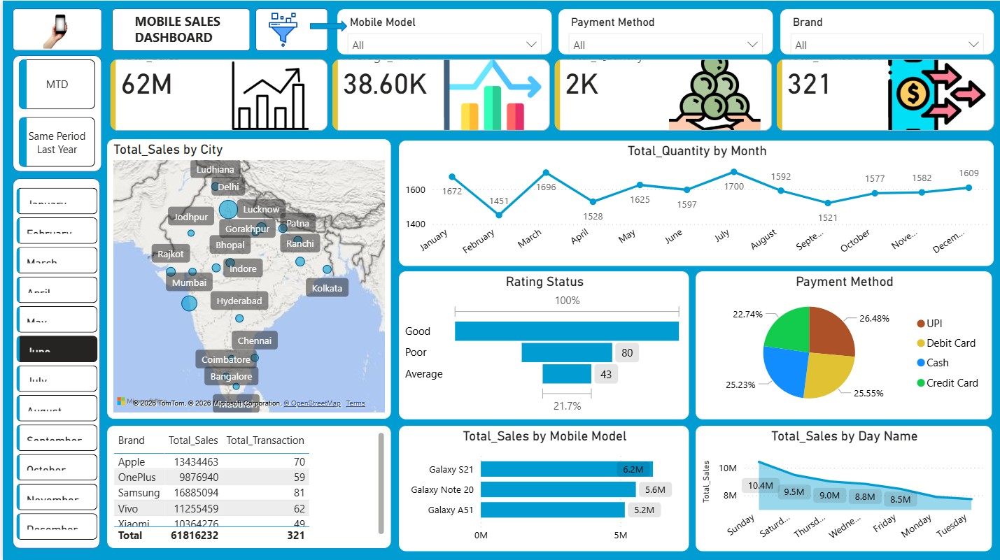
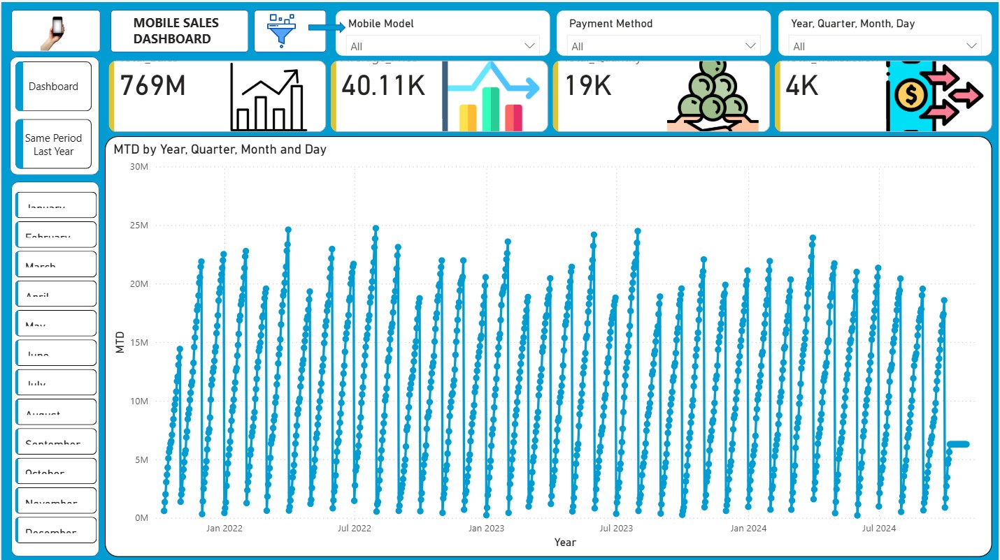

# 📱 Mobile Sales Dashboard | Power BI

## 📌 Project Overview

This project focuses on building an interactive **Mobile Sales Dashboard** using **Power BI** to analyze sales performance, revenue trends, customer behavior, and product insights. The dashboard helps stakeholders monitor key business metrics and make data-driven decisions through dynamic visualizations and KPI tracking.

---

## 🚀 Features

* Data cleaning and transformation for accurate reporting and analysis.
* Custom calendar table creation for time-based analysis.
* Data modeling and relationship management between multiple tables.
* DAX measures for advanced KPI calculations:

  * Month-to-Date (MTD)
  * Quarter-to-Date (QTD)
  * Year-to-Date (YTD)
  * Same Period Last Year (SPLY)
* Interactive charts, cards, slicers, and filters.
* Dynamic filtering and edit interactions for enhanced usability.
* Published on Power BI Service for online reporting and accessibility.

---

## 🛠️ Skills & Technologies Used

* Power BI
* Power Query
* DAX
* Data Modeling
* Data Cleaning
* Data Visualization
* Dashboard Development
* Business Analysis

---

## 📊 Dashboard Insights

The dashboard enables users to:

* Monitor overall sales performance.
* Track revenue trends over time.
* Compare current performance with previous periods.
* Analyze customer purchasing behavior.
* Identify top-performing products and categories.
* Support business decision-making through visual insights.

---

## 📷 Dashboard Screenshots

### Main Dashboard

### Month-to-Date (MTD) Analysis

### Same Period Last Year (SPLY) Analysis

---

## 📈 Key KPIs

* Total Sales
* Total Revenue
* Total Quantity Sold
* MTD Sales
* QTD Sales
* YTD Sales
* Same Period Last Year (SPLY)
* Customer Trends

---

## 🌐 Power BI Service

The dashboard was published to Power BI Service for online access, reporting, and stakeholder collaboration.

---

## 📬 Contact

**Khushpreet**

Aspiring Data Analyst | Power BI | SQL | Python

GitHub: https://github.com/Khushpreet77
